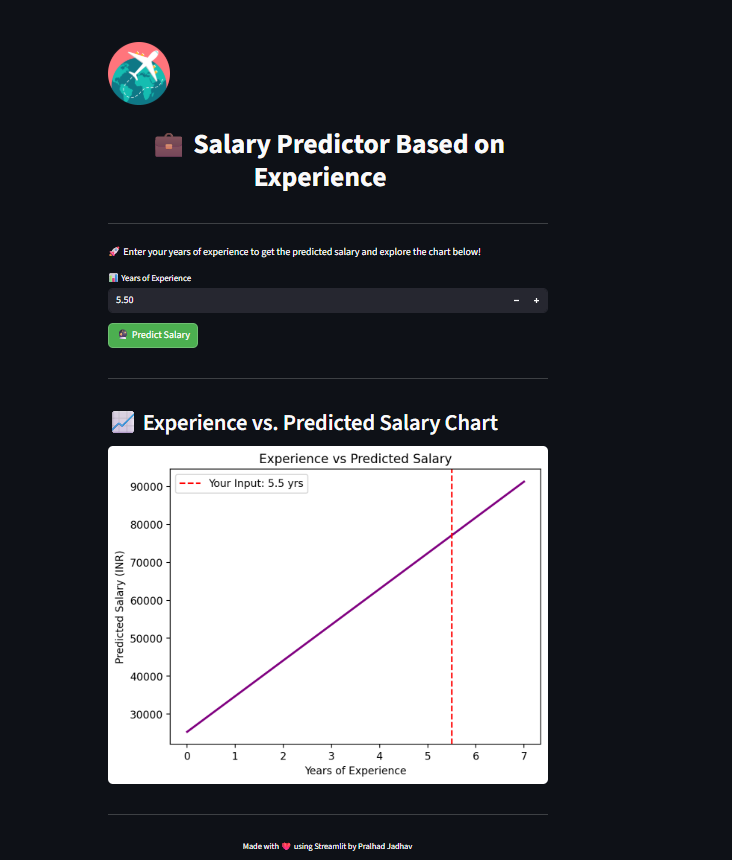

# Salary Predictor using Linear Regression 📈

This project uses **Machine Learning (Linear Regression)** to predict salaries based on years of experience.

## 📂 Files Included
- `Machin_Learning.ipynb` – Model training and evaluation notebook
- `Salary_Data.csv` – Dataset used for training
- `app1.py` – Streamlit web app code to interact with the model
- `requerment.txt` – Required libraries list

## 🚀 How to Run

1. **Install dependencies**  

2. **Run the Web App**

2. **Run the Web App**

## 📊 Dataset Description

| Column Name      | Description              |
|------------------|--------------------------|
| YearsExperience  | Number of years of experience |
| Salary           | Annual salary in dollars |

## ✨ Features
- Train/Test ML model
- Predict salaries interactively
- Web-based UI using Streamlit

## 📸 Screenshot

---

## 🧠 Tech Stack
- Python
- Pandas, Numpy, Scikit-learn
- Streamlit

## 🙋‍♂️ Author
**Parlhad Jadhav**  
[GitHub Profile](https://github.com/parlhad)

## 🔮 Future Improvements
- Add more features (e.g., education level, job role)
- Try other models (e.g., Decision Tree, Random Forest)
- Add download option for predictions

git add README.md
git commit -m "Added project README"
git push
git rm filename
git commit -m "Removed unnecessary file"
git push

---

